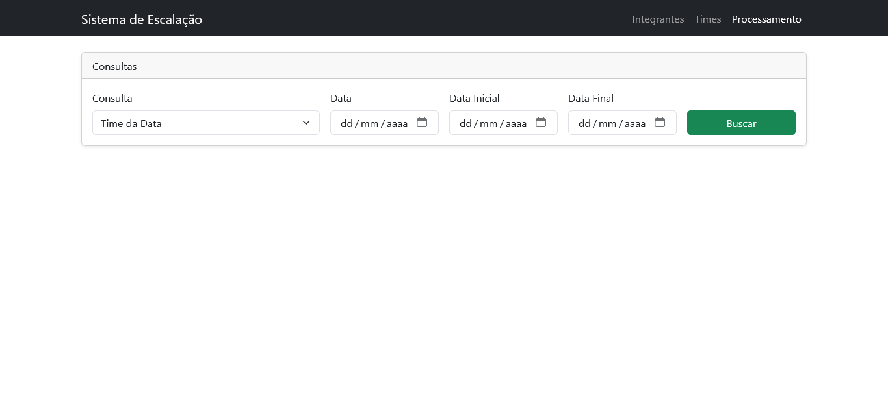
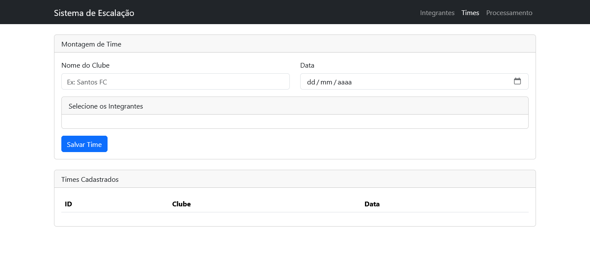
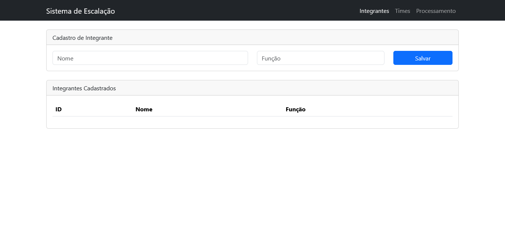

<h1 align="center">Desafio da Élin Duxus</h1>
<div align="center">
  
</div>
<p align='center'>
    
    
    
</p>


## 🔍 Visão Geral

### O Desafio

A DX propõe a construção de um sistema de escalação de times, esportes
tradicionais ou eSports. Toda semana um novo time é montado a partir de
um elenco de integrantes cadastrados. O sistema precisa guardar essas
composições e responder perguntas sobre elas: quem apareceu mais? Qual
clube dominou o período? Qual função foi mais escalada?

O desafio deixa claro onde está o peso da avaliação: lógica de
processamento de dados primeiro, API depois, telas por último.

### O que foi entregue

Todas as funcionalidades do núcleo do desafio foram implementadas e validadas por testes. As entregas contemplam:

* **Funcionalidade 1 (Principal) – Tratamento de Dados:** implementação dos 7 métodos de processamento no `ApiService`, utilizando Java Streams, com testes unitários cobrindo os principais cenários e regras de negócio.

* **Funcionalidade 2 (Extra) – API de Cadastro:** desenvolvimento dos endpoints para cadastro de integrantes e times, incluindo a associação entre times e seus integrantes.

* **Funcionalidade 3 (Extra) – API para Processamento de Dados:** disponibilização dos 7 métodos de processamento por meio de endpoints REST, permitindo a consulta dos dados processados diretamente pela API.

* **Funcionalidade 4 (Extra) – Interface Web com Thymeleaf:** implementação de telas para cadastro de integrantes, montagem de times e consulta dos processamentos de dados. As telas foram desenvolvidas com Thymeleaf e Bootstrap, permitindo utilizar as principais funcionalidades da aplicação através de uma interface gráfica simples e funcional.

* **Suporte à Persistência:** configuração de banco de dados H2 em memória para execução local e realização de testes.

* **Containerização:** configuração do ambiente com Docker Compose, permitindo a inicialização completa da aplicação por meio do comando `docker compose up`.

* **Documentação e Coleção Postman:** disponibilização de documentação de uso e coleção Postman para facilitar os testes dos endpoints da aplicação.


## Índice
- 🔍 [Visão Geral](#-visão-geral)
- ⚙️ [Endpoints](#-endpoints)
- 🎨 [Telas da Aplicação](#-telas)
- 📄 [Pré-requisitos](#-requisitos)
- 🔧 [Como executar?](#-como-executar)
- 🛠️ [Testando API com Postman](#-testando-api-com-postman)
- 💻 [Tecnologias utilizadas](#-tecnologias-utilizadas)
- 👥 [Autor](#-autor)

## ⚙️ Endpoints
Os endpoints da API deste projeto são diversos, por isso estão organizados por seus respectivos controllers:

### **`IntegranteController`**

Responsável pelo cadastro de integrantes que poderão compor os times.

| Endpoint                       | Visão geral                                           |
| ------------------------------ | ----------------------------------------------------- |
| **POST** `/api/v1/integrantes` | Cadastra um novo integrante informando nome e função. |

**Exemplo de requisição**

```json
{
  "nome": "Bangalore",
  "funcao": "ATACANTE"
}
```

---

### **`TimeController`**

Responsável pelo cadastro de times e suas respectivas composições.

| Endpoint                 | Visão geral                                                               |
| ------------------------ | ------------------------------------------------------------------------- |
| **POST** `/api/v1/times` | Cadastra um novo time informando clube, data e integrantes participantes. |

**Exemplo de requisição**

```json
{
  "nome": "Falcons",
  "data": "2021-01-15",
  "integrantes": [1, 2, 3]
}
```

---

### **`ApiController`**

Responsável pelo processamento dos dados dos times cadastrados, retornando estatísticas e consultas solicitadas pelo desafio.

| Endpoint                                           | Visão geral                                                              |
| -------------------------------------------------- | ------------------------------------------------------------------------ |
| **GET** `/api/v1/time-da-data?data=yyyy-MM-dd`     | Retorna o time e sua composição para a data informada.                   |
| **GET** `/api/v1/integrante-mais-usado`            | Retorna o integrante presente em mais times dentro do período informado. |
| **GET** `/api/v1/integrantes-time-mais-recorrente` | Retorna os integrantes do time que mais se repetiu no período.           |
| **GET** `/api/v1/funcao-mais-recorrente`           | Retorna a função mais recorrente nos times dentro do período.            |
| **GET** `/api/v1/clube-mais-recorrente`            | Retorna o clube que mais apareceu no período.                            |
| **GET** `/api/v1/contagem-clubes`                  | Retorna a quantidade de aparições de cada clube no período.              |
| **GET** `/api/v1/contagem-funcao`                  | Retorna a quantidade de ocorrências de cada função no período.           |

#### Parâmetros opcionais de período

Os endpoints abaixo aceitam os parâmetros:

| Parâmetro      | Tipo                | Obrigatório |
| -------------- | ------------------- | ----------- |
| `data-inicial` | Date (`yyyy-MM-dd`) | Não         |
| `data-final`   | Date (`yyyy-MM-dd`) | Não         |

Endpoints que utilizam esses parâmetros:

* `/integrante-mais-usado`
* `/integrantes-time-mais-recorrente`
* `/funcao-mais-recorrente`
* `/clube-mais-recorrente`
* `/contagem-clubes`
* `/contagem-funcao`

**Exemplo**

```http
GET /api/v1/clube-mais-recorrente?data-inicial=2021-01-01&data-final=2021-12-31
```

---

### Exemplos de respostas

#### **GET** `/api/v1/time-da-data?data=2021-01-15`

```json
{
  "data": "2021-01-15",
  "clube": "Falcons",
  "integrantes": [
    "Bangalore",
    "BloodHound",
    "Crypto"
  ]
}
```

#### **GET** `/api/v1/integrante-mais-usado`

```json
{
  "id": 1,
  "nome": "Bangalore",
  "funcao": "ATACANTE"
}
```

#### **GET** `/api/v1/funcao-mais-recorrente`

```json
{
  "funcao": "MEIA"
}
```

#### **GET** `/api/v1/clube-mais-recorrente`

```json
{
  "clube": "Falcons"
}
```

#### **GET** `/api/v1/contagem-clubes`

```json
{
  "Falcons": 5,
  "FURIA": 2,
  "DarkZero Esports": 3
}
```

#### **GET** `/api/v1/contagem-funcao`

```json
{
  "ATACANTE": 10,
  "MEIA": 8,
  "GOLEIRO": 4,
  "VOLANTE": 3
}
```

## 🎨 Telas

Como funcionalidade adicional, foi desenvolvida uma interface web utilizando **Thymeleaf** e **Bootstrap**, permitindo utilizar as principais funcionalidades da aplicação através do navegador de forma simples e intuitiva.

As seguintes telas estão disponíveis nos seguintes caminhos:

### `/telas/integrantes`

Tela responsável pelo cadastro de integrantes. Nela é possível informar o nome e a função de cada participante, além de visualizar todos os integrantes já cadastrados no sistema.

**Exemplo da tela:**



---

### `/telas/times`

Tela utilizada para a montagem dos times. Permite informar o nome do clube, a data da escalação e selecionar os integrantes que farão parte da composição do time.

**Exemplo da tela:**



---

### `/telas/processamento`

Tela destinada à execução das consultas de processamento de dados previstas no desafio. Através dela é possível selecionar uma das análises disponíveis, informar datas quando necessário e visualizar o resultado diretamente na interface.

As consultas disponíveis são:

* Time da Data
* Integrante Mais Usado
* Integrantes do Time Mais Recorrente
* Função Mais Recorrente
* Clube Mais Recorrente
* Contagem de Clubes no Período
* Contagem por Função

**Exemplo da tela:**



## 📄 Requisitos
Para rodar a aplicação é necessário ter as seguintes ferramentas instaladas:

| Tecnologia | Versão | Download |
|---|---|---|
| Java (JDK) | 8 | https://adoptium.net/temurin/releases/?version=8 |
| Maven | 3.6+ | https://maven.apache.org/download.cgi |
| Node.js | 18+ | https://nodejs.org/en/download |
| Docker Desktop | 20.10+ | https://www.docker.com/products/docker-desktop |
| Postman | 10+ | https://www.postman.com/downloads/ |

> - **Maven é opcional**. O projeto inclui o Maven Wrapper (`./mvnw`),
> que baixa a versão correta automaticamente na primeira execução.
>
> - **Node.js** é necessário para o setup dos git hooks e para usar
> os atalhos de Docker via npm.
>
> - **Postman** é recomendado para testar os endpoints da API, mas pode ser substituído por qualquer cliente HTTP de sua preferência.

Para o perfil de teste, o banco de dados padrão é H2 em memória. Para usar o PostgreSQL, inicie o container do docker com `npm run services:up`.

## 🔧 Como executar?

Siga os passos abaixo para executar a aplicação localmente.

### 1. Clone o repositório

```bash
git clone git@github.com:oryanend/desafioDX-Programador.git
```

### 2. Importe o projeto na IDE

- Abra a IDE de sua preferência (recomendado: IntelliJ IDEA).
- Selecione **Open** e escolha a pasta do projeto clonado.
- Aguarde a indexação e a configuração automática do projeto pelo Maven.

### 3. Verifique as dependências

- Certifique-se de que todas as dependências Maven foram baixadas corretamente.
- Caso necessário, execute um **Reload Maven Project**.

## Opção 1 - Executar com Docker (Recomendado)

Esta é a forma mais simples de executar o projeto.

- Abra o Docker Desktop e certifique-se de que o Docker está em execução.
- Navegue até a raiz do projeto.
- Execute o comando:

```bash
npm run services:up
```
- Caso o docker não consiga iniciar o container dado algum erro, utilize o comando `npm run services:up` novamente e verifique se Docker Desktop está aberto e funcionando corretamente.

> **Observações** 
> - Caso você queira pausar os serviços mantendo o container, utilize o comando `npm run services:stop`.
> - Caso pausar os serviços e remover os containers, utilize `npm run services:down`.

## Opção 2 - Executar sem Docker

Caso prefira executar a aplicação diretamente pela IDE:

- Certifique-se de possuir, pelo menos, o **Java 8** instalado.
- Execute a classe principal da aplicação:

```java
DuxusDesafioApplication
```

Ou utilize o Maven:

```bash
./mvnw spring-boot:run
```

> O projeto utiliza banco de dados H2 em memória por padrão, portanto não é necessária nenhuma configuração adicional de banco de dados.

### Acessando a API

Após a inicialização, a API estará disponível para consumo.

Ferramentas recomendadas para testes:

- **Postman (Recomendado)**
- Insomnia
- cURL

Os endpoints contemplam tanto as operações de cadastro (times e integrantes) quanto as funcionalidades de processamento de dados.

## 🛠️ Testando API com Postman
Para facilitar o teste dos endpoints da API, disponibilizei uma coleção e um ambiente (environment) no Postman contendo todas as requisições disponíveis. Siga os passos abaixo para importar a coleção e começar a testar:
1. **Importar a Coleção e o Ambiente:**
   - Baixe os arquivos `DuxusDesafio.postman_collection.json` e `DuxusDesafio.postman_environment.json` disponíveis dentro do diretório `docs/postman` do projeto.
   - Abra o Postman e clique no botão "File" localizado no canto superior esquerdo da interface. Em seguida, selecione a opção "Import" e depois localize os dois arquivos e selecione-os

2. **Teste os Endpoints:**
   - Agora que a coleção foi importada com sucesso, você verá todas as requisições listadas no painel esquerdo do Postman. Basta selecionar a requisição desejada e clicar em "Send" para testá-la.
   - Na parte superior direita do Postman, você verá um dropdown com a lista de environments. Selecione o environment recém-importado.

**Observação:** Ao selecionar a coleção importada no painel esquerdo do Postman, você encontrará informações adicionais, incluindo um guia de uso, instruções para realizar as requisições e uma sugestão de ordem recomendada para execução dos testes.

## 💻 Tecnologias utilizadas

        

# 👥 Autor

| [<br><sub>Ryan Oliveira</sub>](https://github.com/oryanend) |
| :---: |